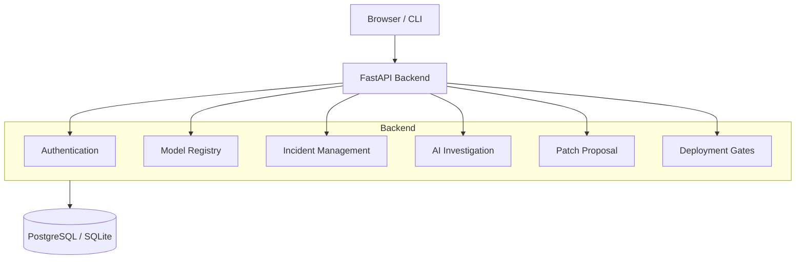

# Architecture

ModelSentinel is built on a monolithic REST architecture to ensure maintainability, clear data boundaries, and straightforward deployment.

## High-Level Components

## Data Flow

1. **Telemetry & Monitoring**: External systems or the internal runner POST telemetry data for a model. If metrics fall below defined SLO thresholds, an Alert is generated.
2. **Incident Creation**: Alerts are deduplicated and escalated into Incidents.
3. **Investigation**: AI agents pull historical context, repository structure, and telemetry to form hypotheses about the root cause.
4. **Patch Proposal**: Based on confirmed hypotheses, the system proposes diffs to the associated code repository.
5. **Validation & Regression**: Patches are subjected to validation runs against historical data and regression suites.
6. **Deployment & Memory**: Approved patches trigger deployment gates. Successful resolutions are stored in Incident Memory to accelerate future investigations.

## Key Technologies

- **FastAPI**: Provides async route handlers and automatic OpenAPI documentation.
- **SQLAlchemy & Alembic**: ORM and migration management. The schema is designed for PostgreSQL but uses SQLite in the local demo for simplicity.
- **React & Vite**: A fast, responsive frontend relying on TanStack Query for state management and Tailwind CSS for styling.
